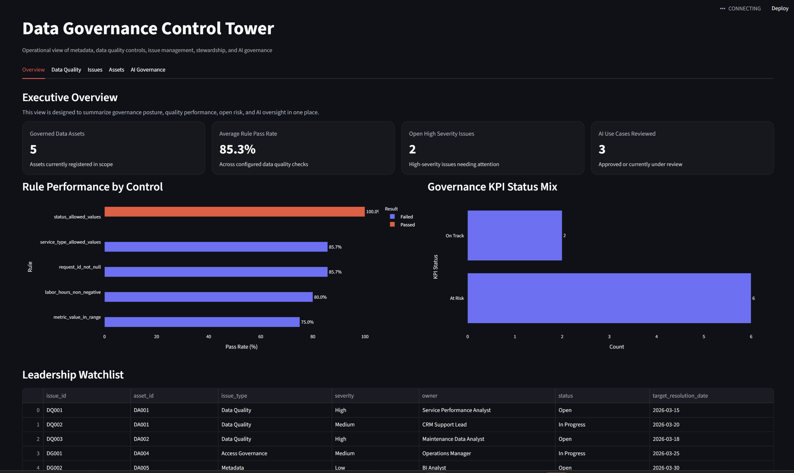

# Data Governance Control Tower

[](https://sima-governance-tower.streamlit.app)

**Live app:** https://sima-governance-tower.streamlit.app

An operational data governance and responsible AI control tower that demonstrates how governance can be translated into concrete controls, measurable KPIs, stewardship structures, issue management workflows, access governance, data quality monitoring, AI use-case intake, GenAI risk management, data readiness review, model documentation, and executive dashboarding.

## Dashboard Snapshot



## Why this project exists

Many governance discussions stay at the policy level. This project shows a more practical operating model by making governance visible through working artifacts, quality checks, dashboards, and decision logs.

The repository is designed to simulate a governance control tower for a business environment with multiple operational and reporting assets. It focuses on day-to-day governance execution rather than governance theory alone.

## What this project demonstrates

- Data asset inventory and stewardship accountability
- Business glossary and data dictionary structure
- Data quality rule design and executable validation checks
- Governance issue logging and escalation visibility
- Access governance decision logging
- Governance KPI monitoring
- AI use case registration and risk review
- Lightweight responsible AI governance documentation
- A dashboard for executive and operational governance monitoring

## Dashboard modules

### 1. Overview
Provides an executive summary of governance posture, including:
- governed assets in scope
- average data quality pass rate
- open high-severity issues
- AI use cases under review

### 2. Data Quality
Shows:
- configured quality controls
- pass and fail outcomes
- failed rows by quality dimension
- average pass rate by asset

### 3. Issues
Shows:
- open governance and data quality issues
- severity distribution
- issue type distribution
- issue ownership and target resolution dates

### 4. Assets
Shows:
- governed asset inventory
- classification mix
- criticality profile
- lineage documentation coverage

### 5. AI Governance
Shows:
- AI use case register
- risk-level profile
- review status
- AI risk assessment log

## Repository structure

```text
data-governance-control-tower/
+-- data/
¦   +-- raw/
¦   +-- curated/
+-- metadata/
+-- quality_rules/
+-- governance/
+-- ai_governance/
+-- dashboards/
+-- docs/
+-- screenshots/
Key artifacts included
Metadata
metadata/data_asset_register.csv
metadata/business_glossary.yml
metadata/data_dictionary.csv
Governance operations
governance/access_decision_log.csv
governance/issue_log.csv
governance/stewardship_raci.csv
governance/governance_kpis.csv
Data quality
quality_rules/rules.yml
quality_rules/checks.py
data/raw/*.csv
data/curated/quality_check_results.csv
AI governance
ai_governance/ai_use_case_register.csv
ai_governance/ai_risk_assessment.csv
ai_governance/model_card_template.md
Documentation
docs/architecture.md
docs/lineage.md
docs/controls_framework.md
Dashboard Preview
Data Quality

Issues

Assets

AI Governance

Tech stack
Python
Pandas
PyYAML
Streamlit
Plotly
DuckDB
How to run locally
1. Install dependencies
pip install -r requirements.txt
2. Run the quality checks
python quality_rules/checks.py
3. Launch the dashboard
streamlit run dashboards/app.py
Example governance questions this project can answer
Which governed assets are high criticality?
Which controls are currently failing?
Where are failed rows concentrated?
Which issues are still open and who owns them?
Which assets have incomplete lineage coverage?
Which AI use cases are high risk or still under review?
Portfolio value

This project is meant to show practical capability in:

data governance
data quality management
stewardship design
governance operations
metadata management
issue and control monitoring
Responsible AI and GenAI governance operations
Next enhancements

Planned improvements include:

trend analysis over time
dashboard filtering
scheduled checks through GitHub Actions
richer governance metrics and exception handling
dashboard integration for AI risk monitoring, GenAI controls, and responsible AI governance KPIs
Author

Sima Saadi

This repository is part of a broader portfolio focused on data governance, analytics engineering, reporting controls, and applied AI governance.

---

## Responsible AI and GenAI Governance Layer

This project has been extended with a responsible AI and generative AI governance module. The module demonstrates how organizations can govern AI use cases through practical operating controls, not just policy statements.

The AI governance layer includes:

- AI use-case intake and approval workflow
- AI system inventory
- AI risk assessment mapped to governance controls
- NIST AI RMF and NIST Generative AI Profile mapping
- Generative AI risk register
- Data readiness for AI checklist
- Privacy, security, and vendor review checklists
- Model card and AI system documentation templates
- Human oversight and escalation SOP
- AI issue and incident log
- Responsible AI control library

The purpose is to connect core data governance foundations such as ownership, metadata, lineage, data quality, classification, access control, stewardship, and issue management to current AI governance risks such as hallucination, sensitive data exposure, weak traceability, bias, overreliance, vendor risk, and model monitoring.


