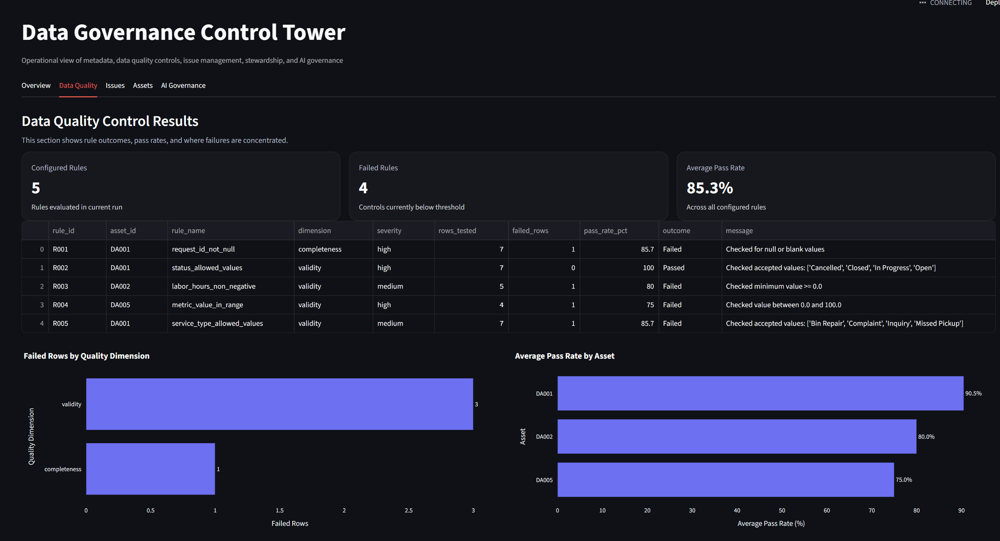
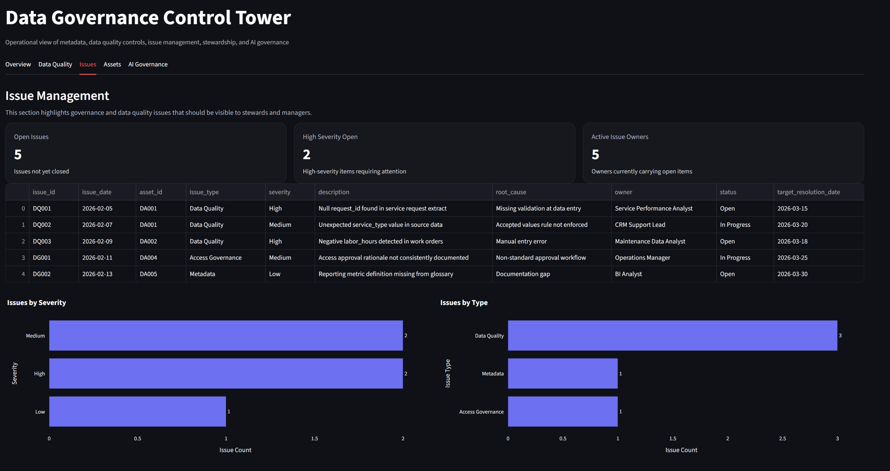
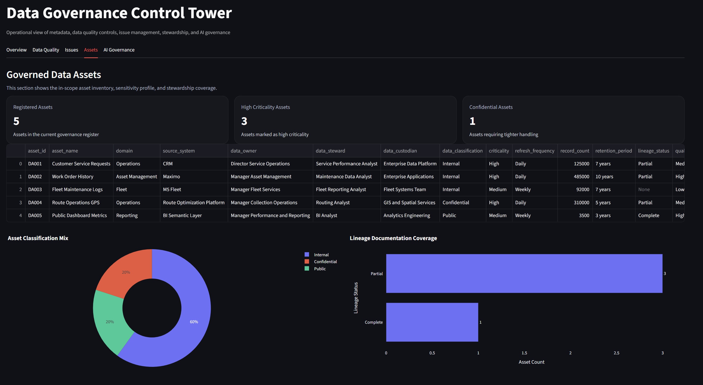
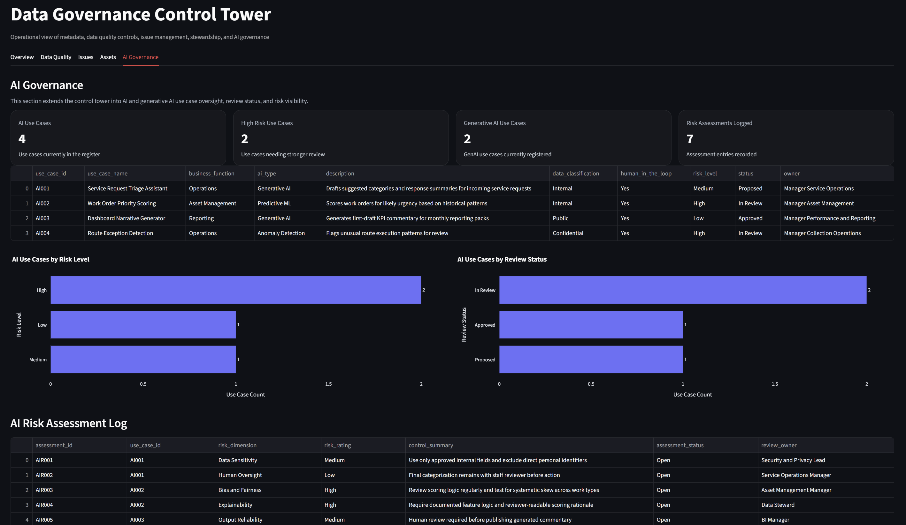

## Repository structure

```text
data-governance-control-tower/
+-- data/
¦   +-- raw/
¦   +-- curated/
+-- metadata/
+-- quality_rules/
+-- governance/
+-- ai_governance/
+-- dashboards/
+-- docs/
+-- screenshots/
```

## Key artifacts included

### Metadata
- `metadata/data_asset_register.csv`
- `metadata/business_glossary.yml`
- `metadata/data_dictionary.csv`

### Governance operations
- `governance/access_decision_log.csv`
- `governance/issue_log.csv`
- `governance/stewardship_raci.csv`
- `governance/governance_kpis.csv`

### Data quality
- `quality_rules/rules.yml`
- `quality_rules/checks.py`
- `data/raw/*.csv`
- `data/curated/quality_check_results.csv`

### AI governance
- `ai_governance/ai_use_case_register.csv`
- `ai_governance/ai_risk_assessment.csv`
- `ai_governance/model_card_template.md`

### Documentation
- `docs/architecture.md`
- `docs/lineage.md`
- `docs/controls_framework.md`

## Dashboard Preview

### Data Quality


### Issues


### Assets


### AI Governance


## Tech stack

- Python
- Pandas
- PyYAML
- Streamlit
- Plotly
- DuckDB

## How to run locally

### 1. Install dependencies
```bash
pip install -r requirements.txt
```

### 2. Run the quality checks
```bash
python quality_rules/checks.py
```

### 3. Launch the dashboard
```bash
streamlit run dashboards/app.py
```

## Example governance questions this project can answer

- Which governed assets are high criticality?
- Which controls are currently failing?
- Where are failed rows concentrated?
- Which issues are still open and who owns them?
- Which assets have incomplete lineage coverage?
- Which AI use cases are high risk or still under review?

## Portfolio value

This project is meant to show practical capability in:
- data governance
- data quality management
- stewardship design
- governance operations
- metadata management
- issue and control monitoring
- AI governance foundations

## Next enhancements

Planned improvements include:
- trend analysis over time
- dashboard filtering
- screenshot gallery in the README
- scheduled checks through GitHub Actions
- richer governance metrics and exception handling
- expanded AI governance controls mapped to formal frameworks

## Author

Sima Saadi

This repository is part of a broader portfolio focused on data governance, analytics engineering, reporting controls, and applied AI governance.
